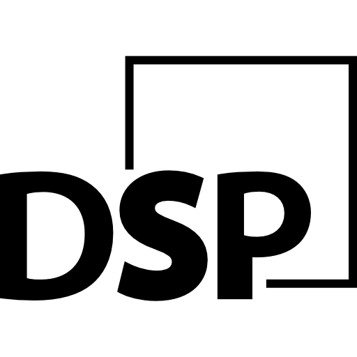

<div id="top"></div>

<!-- PROJECT SHIELDS -->
[![Contributors][contributors-shield]][contributors-url]
[![Forks][forks-shield]][forks-url]
[![Stargazers][stars-shield]][stars-url]
[![Issues][issues-shield]][issues-url]
[![Apache License][license-shield]][license-url]
[![LinkedIn][linkedin-shield]][linkedin-url]


<!-- PROJECT LOGO -->
<br />

<div align="center">
    <a href="https://github.com/yuramorozov01/dsp">
        
    </a>

<h3 align="center">Digital Signal Processing</h3>

<p align="center">
    Visualization service of basic DSP operations.
    <br />
    <br />
    <a href="https://github.com/yuramorozov01/dsp/issues">Report Bug</a>
    ·
    <a href="https://github.com/yuramorozov01/dsp/issues">Request Feature</a>
    </p>
</div>


<!-- TABLE OF CONTENTS -->
<details>
    <summary>Table of Contents</summary>
    <ol>
        <li>
            <a href="#about-the-project">About The Project</a>
            <ul>
                <li><a href="#built-with">Built With</a></li>
            </ul>
        </li>
        <li>
            <a href="#getting-started">Getting Started</a>
            <ul>
                <li><a href="#prerequisites">Prerequisites</a></li>
                <li><a href="#installation">Installation</a></li>
            </ul>
        </li>
        <li><a href="#executing">Executing</a></li>
        <li><a href="#contributing">Contributing</a></li>
        <li><a href="#license">License</a></li>
        <li><a href="#contact">Contact</a></li>
    </ol>
</details>


<!-- ABOUT THE PROJECT -->
## About The Project

[![DSP screenshot][product-screenshot]](https://github.com/yuramorozov01/dsp)

This web-application provides visualization of basic digital signal processing operations.

Five basic operations were demonstrated in this applications:
* Harmonic signal processing
* Polyharmonic signal processing
* Fourier transform
* Simple correlation (1-dimensional)
* Image correlation (2-dimensional)

Also you can save your results and share them.

For more details about operations you should visit the main page.

<p align="right">(<a href="#top">back to top</a>)</p>


### Built With

* [Python](https://www.python.org)
* [Django](https://www.djangoproject.com)
* [Django Rest Framework](https://www.django-rest-framework.org)
* [Docker Compose](https://docs.docker.com/compose/)
* [PostgreSQL](https://www.postgresql.org)
* [Angular](https://angular.io)

<p align="right">(<a href="#top">back to top</a>)</p>


<!-- GETTING STARTED -->
## Getting Started

### Prerequisites

To run this program you have to follow this steps:

* Install [Docker Compose](https://docs.docker.com/compose/)
* Install [Node.js](https://nodejs.org/en/download/)

### Installation
1. Clone the repo
   ```sh
   git clone https://github.com/yuramorozov01/dsp.git
   cd dsp/
   ```
2. Create .env file in the root folder (near docker-compose.yaml).
   You can find example parameters in the file .env.example
3. Give execute root to run bash scripts
   ```sh
   chmod +x run.sh services/backend/dsp_run.sh services/backend/wait-for-it.sh
   ```
4. Install web-client dependencies
   ```sh
   cd services/frontend
   npm install
   ```
<p align="right">(<a href="#top">back to top</a>)</p>


<!-- Executing EXAMPLES -->
## Executing
1. Run server-part (in the root folder)
   ```sh
   ./run.bash
   ```
2. Run web-client: 
   ```sh
   cd services/frontend
   npm run start
   ```
3. Open the following URL:
   ```
   localhost:4200/
   ```

<p align="right">(<a href="#top">back to top</a>)</p>


<!-- CONTRIBUTING -->
## Contributing

Contributions are what make the open source community such an amazing place to learn, inspire, and create. Any contributions you make are **greatly appreciated**.

If you have a suggestion that would make this better, please fork the repo and create a pull request. You can also simply open an issue with the tag "enhancement".
Don't forget to give the project a star! Thanks again!

1. Fork the Project
2. Create your Feature Branch (`git checkout -b feature/AmazingFeature`)
3. Commit your Changes (`git commit -m 'Add some AmazingFeature'`)
4. Push to the Branch (`git push origin feature/AmazingFeature`)
5. Open a Pull Request

<p align="right">(<a href="#top">back to top</a>)</p>


<!-- LICENSE -->
## License

Distributed under the Apache-2.0 License. See `LICENSE.txt` for more information.

<p align="right">(<a href="#top">back to top</a>)</p>


<!-- CONTACT -->
## Contact

Yura Morozov - [LinkedIn](https://linkedin.com/in/yuramorozov01) - yura_morozov01@mail.ru

Project Link: [https://github.com/yuramorozov01/dsp](https://github.com/yuramorozov01/dsp)

<p align="right">(<a href="#top">back to top</a>)</p>


<!-- MARKDOWN LINKS & IMAGES -->
<!-- https://www.markdownguide.org/basic-syntax/#reference-style-links -->
[contributors-shield]: https://img.shields.io/github/contributors/yuramorozov01/dsp.svg?style=for-the-badge
[contributors-url]: https://github.com/yuramorozov01/dsp/graphs/contributors
[forks-shield]: https://img.shields.io/github/forks/yuramorozov01/dsp.svg?style=for-the-badge
[forks-url]: https://github.com/yuramorozov01/dsp/network/members
[stars-shield]: https://img.shields.io/github/stars/yuramorozov01/dsp.svg?style=for-the-badge
[stars-url]: https://github.com/yuramorozov01/dsp/stargazers
[issues-shield]: https://img.shields.io/github/issues/yuramorozov01/dsp.svg?style=for-the-badge
[issues-url]: https://github.com/yuramorozov01/dsp/issues
[license-shield]: https://img.shields.io/github/license/yuramorozov01/dsp.svg?style=for-the-badge
[license-url]: https://github.com/yuramorozov01/dsp/blob/main/LICENSE.txt
[linkedin-shield]: https://img.shields.io/badge/-LinkedIn-black.svg?style=for-the-badge&logo=linkedin&colorB=555
[linkedin-url]: https://linkedin.com/in/yuramorozov01
[product-screenshot]: images/screenshot.png